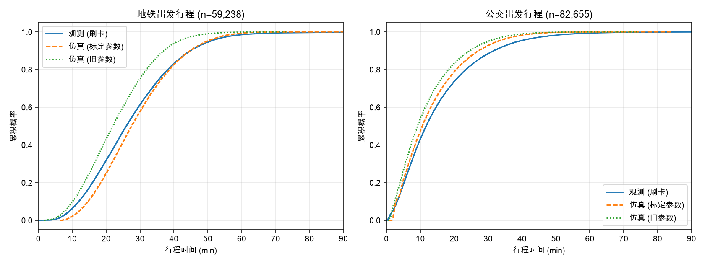
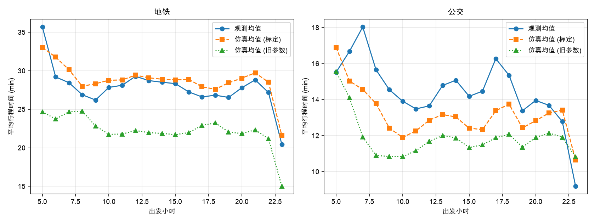
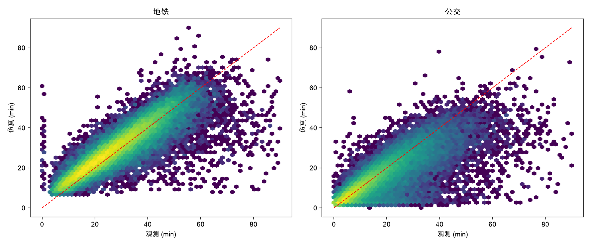

# 2019-05-13 仿真 vs 观测 验证报告

配置：`config/calibrated_20190513.yaml`，demand.fraction = 0.05，05:00–24:00，路网 2019，路径选择 logit(k=5)。

口径：地铁出发行程比较 进站刷卡→出站刷卡 总时间；公交出发行程比较 上车→下车（仿真扣除首次候车）。

## 1. 总体指标（分钟）

| 组 | n | 观测均值 | 仿真均值 (标定) | 仿真均值 (旧参数) | 观测中位 | 仿真中位 (标定) | 观测 P90 | 仿真 P90 (标定) | 均误差 | MAE | KS | Wasserstein |
|---|---:|---:|---:|---:|---:|---:|---:|---:|---:|---:|---:|---:|
| all | 141,893 | 20.3 | 19.7 | 16.2 | 17.6 | 17.5 | 39.6 | 38.3 | -0.6 | 4.4 | 0.027 | 0.65 |
| subway | 59,238 | 27.6 | 28.8 | 23.0 | 25.9 | 27.5 | 44.9 | 44.8 | +1.2 | 4.4 | 0.073 | 1.78 |
| bus | 82,655 | 15.0 | 13.2 | 11.7 | 11.7 | 10.7 | 31.6 | 27.1 | -1.9 | 4.3 | 0.054 | 1.98 |

旧参数对照（同一路网/需求/选择模型，仅参数不同）：
| 组 | 仿真均值 | 均误差 | MAE | KS | Wasserstein |
|---|---:|---:|---:|---:|---:|
| all | 16.2 | -3.8 | 6.2 | 0.102 | 3.83 |
| subway | 23.0 | -4.5 | 7.5 | 0.137 | 4.53 |
| bus | 11.7 | -3.3 | 5.3 | 0.111 | 3.35 |

## 2. 系统层面

| 指标 | 标定参数 | 旧参数 |
|---|---:|---:|
| 乘客数 | 142143 | 142143 |
| 完成率 | 0.998 | 0.976 |
| 超时退出 | 233 | 3385 |
| 平均候车 (min) | 3.847 | 4.581 |
| 平均步行 (min) | 0.838 | 0.930 |
| 平均车内 (min) | 15.021 | 11.044 |
| 平均换乘次数 | 0.378 | 0.421 |
| 运行时间 (s) | 12.943 | 76.822 |

## 3. 分小时均值（标定参数）

| 模式 | 小时 | n | 观测均值 | 仿真均值 | 观测中位 | 仿真中位 |
|---|---:|---:|---:|---:|---:|---:|
| bus | 5 | 763 | 15.5 | 16.9 | 13.6 | 14.3 |
| bus | 6 | 3,901 | 16.7 | 15.0 | 13.5 | 12.8 |
| bus | 7 | 7,634 | 18.0 | 14.6 | 13.8 | 11.7 |
| bus | 8 | 8,847 | 15.7 | 13.8 | 11.9 | 11.0 |
| bus | 9 | 7,053 | 14.5 | 12.4 | 10.9 | 9.7 |
| bus | 10 | 5,610 | 13.9 | 11.9 | 10.6 | 9.6 |
| bus | 11 | 4,707 | 13.5 | 12.3 | 10.4 | 9.8 |
| bus | 12 | 4,293 | 13.7 | 12.9 | 10.8 | 10.3 |
| bus | 13 | 4,148 | 14.8 | 13.2 | 11.4 | 10.7 |
| bus | 14 | 4,393 | 15.1 | 13.0 | 11.8 | 10.3 |
| bus | 15 | 4,769 | 14.2 | 12.4 | 11.1 | 10.0 |
| bus | 16 | 5,401 | 14.5 | 12.3 | 11.4 | 10.0 |
| bus | 17 | 6,630 | 16.3 | 13.4 | 12.9 | 10.8 |
| bus | 18 | 5,880 | 15.3 | 13.8 | 12.5 | 11.3 |
| bus | 19 | 3,560 | 13.4 | 12.4 | 10.7 | 10.0 |
| bus | 20 | 2,546 | 14.0 | 12.8 | 11.5 | 10.5 |
| bus | 21 | 1,759 | 13.7 | 13.3 | 11.5 | 10.7 |
| bus | 22 | 720 | 12.8 | 13.4 | 10.6 | 11.2 |
| bus | 23 | 41 | 9.2 | 10.6 | 8.8 | 10.0 |
| subway | 5 | 407 | 35.7 | 33.0 | 34.5 | 32.7 |
| subway | 6 | 2,348 | 29.2 | 31.8 | 27.8 | 30.5 |
| subway | 7 | 7,376 | 28.5 | 30.1 | 27.1 | 29.0 |
| subway | 8 | 8,005 | 26.9 | 28.0 | 25.3 | 26.7 |
| subway | 9 | 3,867 | 26.2 | 28.3 | 24.4 | 27.0 |
| subway | 10 | 2,297 | 27.8 | 28.8 | 26.0 | 27.3 |
| subway | 11 | 2,126 | 28.1 | 28.8 | 26.2 | 27.7 |
| subway | 12 | 2,113 | 29.3 | 29.4 | 27.5 | 28.3 |
| subway | 13 | 2,296 | 28.7 | 29.1 | 27.0 | 27.8 |
| subway | 14 | 2,291 | 28.5 | 28.9 | 26.7 | 27.8 |
| subway | 15 | 2,475 | 28.3 | 28.8 | 26.4 | 27.5 |
| subway | 16 | 3,255 | 27.3 | 28.9 | 25.6 | 27.8 |
| subway | 17 | 6,457 | 26.6 | 27.9 | 25.1 | 26.7 |
| subway | 18 | 6,069 | 26.8 | 27.6 | 25.1 | 26.2 |
| subway | 19 | 3,254 | 26.5 | 28.4 | 25.1 | 27.5 |
| subway | 20 | 2,192 | 27.8 | 29.1 | 26.0 | 27.7 |
| subway | 21 | 1,618 | 28.8 | 29.7 | 27.1 | 28.2 |
| subway | 22 | 744 | 27.2 | 28.5 | 25.3 | 27.5 |
| subway | 23 | 48 | 20.4 | 21.6 | 18.2 | 20.5 |

## 4. 图

## 5. 说明

- 仿真中乘客按 logit 选择候选路径，观测行程未必对应仿真所选路径；公交记录只覆盖单次乘车，若仿真为该 OD 选择了含换乘的路径，其比较口径会偏长。
- 地铁的进出站 / 候车 / 换乘步行三者之和可识别、拆分不可识别，见 calibration_summary。
- 车辆容量 = 真实定员 × demand.fraction；小比例抽样下拥挤效应被同比例缩放。
